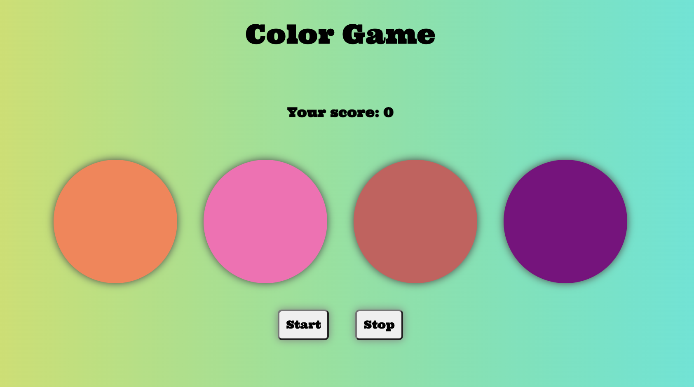

# Speed-game

- REACT project to learn condition rendering, props, state, add handler to event.
- This project is deployed using netlify

## Description

Link to game: https://lucid-booth-db0cd2.netlify.app/

## Screenshot

